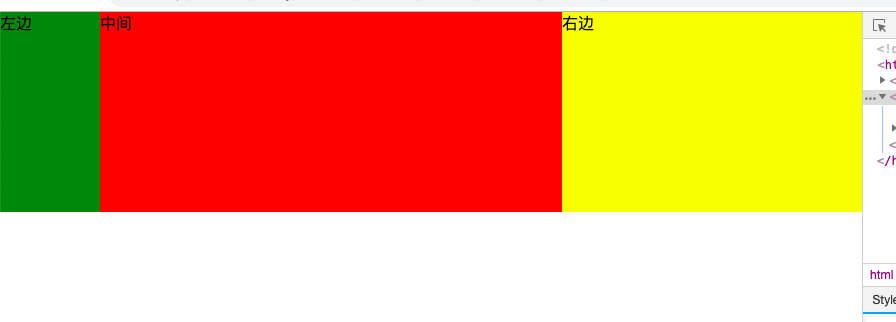
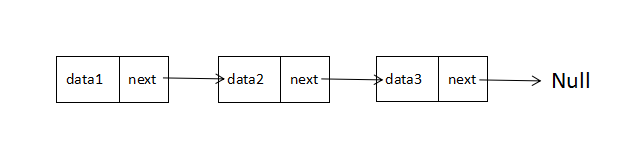
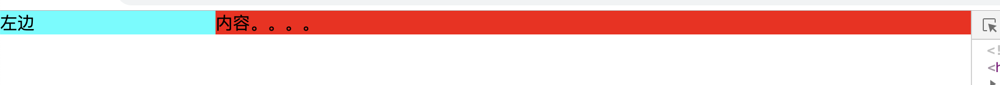

### 前端面试题

#### 1、DOMContentLoaded和onload事件区别和兼容

DOMContentLoaded事件是当初始HTML文档完全被加载和解析（即所有DOM解析完）时触发的，无需要等待样式列表、图片、子框架完成加载。onload事件要等页面所有元素，包括图片以及脚本等全部加载完成才触发，因此它比DOMContentLoaded要更晚执行。

#### 2、js基本数据类型

5个简单数据类型（基本数据类型）+ 1个复杂数据类型 undefiend, number string null boolean + object ES6 新增Symbol

#### 3、Promise实现

```html
<!DOCTYPE html>
<html>

<head>
    <meta charset="utf-8">
    <title></title>
    <meta name="viewport" content="width=device-width, initial-scale=1.0, maximum-scale=1.0, user-scalable=0">
    <meta content="yes" name="apple-mobile-web-app-capable">
    <meta content="black" name="apple-mobile-web-app-status-bar-style">
    <meta content="telephone=no" name="format-detection">
    <meta content="false" id="twcClient" name="twcClient">
    <meta content="sunny。all rights reserved" name="copyright" />
</head>

<body>
    <script type="text/javascript">
        const PENDINGED = 'PENDINGED';
        const FULFILLED = 'FULFILLED';
        const REJECTED = 'REJECTED';
        const isFunction = fn => typeof fn === 'function'
        class MyPromise {
            constructor(fn) {
                if (!isFunction) throw new Error('fn must be a function');
                this._value = null;
                this._status = PENDINGED;
                this._fulfilledQueues = [];
                this._rejectedQueues = [];
                try {
                    fn(this._resolve.bind(this), this._rejected.bind(this));
                } catch (e) {
                    this._reject(e);
                }
            }
            _resolve(value) {
                const run = () => {
                    if (this._status !== PENDINGED) return;
                    this._status = FULFILLED;
                    const runFulfilled = value => {
                        let cb;
                        while (cb = this._fulfilledQueues.shift()) {
                            cb(value);
                        }
                    };
                    const runRejected = error => {
                        while (cb = this._fulfilledQueues.shift()) {
                            cb(error);
                        }
                    };
                    if (value instanceof MyPromise) {
                        value.then(val => {
                            this._value = value;
                            runFulfilled(val);
                        }, error => {
                            this._value = error;
                            runRejected(error);
                        })
                    } else {
                        this._value = value;
                        runFulfilled(value);
                    }
                }
                setTimeout(() => {
                    run();
                }, 0);
            }
            _rejected(error) {
                if (this._status !== PENDINGED) return;
                this._status = REJECTED;
                const runRejected = error => {
                    let cb;
                    while (cb = this._fulfilledQueues.shift()) {
                        cb(error);
                    }
                };
                setTimeout(() => {
                    this._value = error;
                    runRejected()
                }, 0);
            }
            then(onFulfilled, onRejected) {
                const {_value, _status} = this;
                return new MyPromise((onNextFulfilled, onNextRejected) => {
                    const runFulfilled = (val) => {
                        try {
                            if (!isFunction(onFulfilled)) {
                                onNextFulfilled(val);
                            } else {
                                const result = onFulfilled(val);
                                if (result instanceof Mypromise) {
                                    result.then(onNextFulfilled, onNextRejected);
                                } else {
                                    onNextFulfilled(result);
                                }
                            }
                        } catch (e) {
                            onNextRejected(e);
                        }
                    };
                    const runRejected = (error) => {
                        try {
                            if (!isFunction(onFulfilled)) {
                                onNextRejected(error);
                            } else {
                                const result = onRejected(val);
                                if (result instanceof Mypromise) {
                                    result.then(onNextFulfilled, onNextRejected);
                                } else {
                                    onNextFulfilled(result);
                                }
                            }
                        } catch (e) {
                            onNextRejected(e);
                        }
                    };
                    switch (_status) {
                        case PENDINGED:
                            this._fulfilledQueues.push(runFulfilled);
                            this._rejectedQueues.push(runRejected);
                            break;
                        case FULFILLED:
                            runFulfilled(_value);
                            break;
                        case REJECTED:
                            runRejected(_value);
                            break;
                        default:
                            break;
                    }
                })
            }
        }
    	function getUserId () {
    		return new MyPromise((resolve, reject) => {
    			resolve(9999)
    		});
    	}
    	getUserId().then(function (id) {
    		console.log(id);
    	});
    </script>
</body>

</html>

```

#### 4、使用css实现一个三角形

给一个div不设置宽度，设置四个border

```html
<style type="text/css">
* {
    margin: 0;
    padding: 0;
}
.sanjiao{
    width: 0;
    height: 0;
    border-top: 100px solid #f00;
    border-bottom: 100px solid #0f0;
    border-left: 100px solid #00f;
    border-right: 100px solid yellow;
}
</style>

<body>
    <div class="sanjiao"></div>
</body>
```


去除上边框

```html
<style type="text/css">
* {
    margin: 0;
    padding: 0;
}
.sanjiao{
    width: 0;
    height: 0;
    /*border-top: 100px solid #f00;*/
    border-bottom: 100px solid #0f0;
    border-left: 100px solid #00f;
    border-right: 100px solid yellow;
}
</style>

<body>
    <div class="sanjiao"></div>
</body>
```


左右颜色变透明

```html
<style type="text/css">
* {
    margin: 0;
    padding: 0;
}
.sanjiao{
    width: 0;
    height: 0;
    /*border-top: 100px solid #f00;*/
    border-bottom: 100px solid #0f0;
    border-left: 100px solid transparent;
    border-right: 100px solid transparent;
}
</style>

<body>
    <div class="sanjiao"></div>
</body>
```


旋转

```html
<style type="text/css">
* {
    margin: 0;
    padding: 0;
}
.sanjiao{
    width: 0;
    height: 0;
    /*border-top: 100px solid #f00;*/
    border-bottom: 100px solid #0f0;
    border-left: 100px solid transparent;
    border-right: 100px solid transparent;
    transform: rotate(-25deg);
}
</style>

<body>
    <div class="sanjiao"></div>
</body>
```


#### 5、call、apply、bind作用，以及用法

均用于改变函数内部this的指向，有以下不同

```js
Array.prototype.testFunc = function(a, b, c) {
    console.log(this, a, b, c);
};
var a = [1, 2, 3];
a.testFunc('a', 'b', 'c'); // [1, 2, 3] "a" "b" "c"
var b = {a: 'a', b: 'b'};
Array.prototype.testFunc.call(b, 'a', 'b', 'c'); // {a: "a", b: "b"} "a" "b" "c" console打印出的this已经改变
Array.prototype.testFunc.apply(b, ['a', 'b', 'c']); // {a: "a", b: "b"} "a" "b" "c" console打印出的this已经改变, 传参已改变
var c = Array.prototype.testFunc.bind(b, 'a', 'b', 'c'); // 不会执行
c(); // {a: "a", b: "b"} "a" "b" "c" console打印出的this已经改变，传参与call相同

// 模拟call
Function.prototype.myCall = function () {
    var context = [...arguments].shift();
    var args = [...arguments].splice(1);
    var sym = Symbol();
    context[sym] = this;
    context[sym](...args);
    delete context[sym];
}
function a () {
    console.log(this, arguments);
}
a.myCall({a: 1}, 1, 2, 3);
// 模拟apply
Function.prototype.myApply = function () {
    var context = [...arguments].shift();
    var args = [...arguments][1];
    var sym = Symbol();
    context[sym] = this;
    context[sym](...args);
    delete context[sym];
}
a.myApply({a: 1}, 1, 2, 3);
// 模拟bind
Function.prototype.myBind = function () {
    var self = this;
    var context = [...arguments].shift();
    var args = [...arguments].splice(1);
    return function () {
        self.apply(context, args.concat(Array.prototype.slice.apply(arguments)))
    }
}
a.myBind({a: 1}, 1, 2, 3);
```
#### 6、http常见状态码有哪些？401和403区别？

2XX 成功
· 200 OK，表示从客户端发来的请求在服务器端被正确处理
· 204 No content，请求收到，但返回信息为空（cors options请求）
3XX 重定向
· 301 moved permanently 永久性重定向，网页被永久性转移到另一个URL
· 302 found，临时性重定向 请求的网页被转移到一个新的地址，但客户访问仍继续通过原始URL地址
· 303 see other 表示资源存在着另一个 URL，建议客户访问其他URL或访问方式
· 304 not modified 缓存，自从上次请求后，请求的网页未修改过，服务器返回此响应时，不会返回网页内容，代表上次的文档已经被缓存了，还可以继续使用
· 307 temporary redirect，临时重定向，申明请求的资源临时性删除
4XX 客户端错误
· 400 bad request，请求报文存在语法错误
· 401 unauthorized，请求未经授权，认证信息不通过
· 403 forbidden，表示对请求资源的访问被服务器拒绝
· 404 not found，表示在服务器上没有找到请求的资源
5XX 服务器错误
· 500 internal sever error，表示服务器端在执行请求时发生了错误
· 503 service unavailable，表明服务器暂时处于超负载或正在停机维护，无法处理请求

#### 7、数组去重

直接在原数组上进行操作

```js
Array.prototype.quchong = function() {
    var arr = this;
    if (Array.isArray(arr)) {
        for (var i = 0, len = arr.length; i < len; i++) {
            if (arr.indexOf(arr[i]) !== arr.lastIndexOf(arr[i])) {
                arr.splice(i, 1);
                i--;
            }
        }
    }
    return arr;
};
var a = [1, 3, 1, 7, 3, 4, 1, 7, 3]
a.quchong();
console.log(a); // [4, 1, 7, 3]
```

不改变原数组

```js
Array.prototype.quchong = function() {
    var arr = this;
    var arr1 = [];
    if (Array.isArray(arr)) {
        for (var i = 0, len = arr.length; i < len; i++) {
            if (arr1.indexOf(arr[i]) === -1) {
                arr1.push(arr[i]);
            }
        }
    }
    return arr1;
};
var a = [1, 3, 1, 7, 3, 4, 1, 7, 3]
var b = a.quchong();
console.log(a, b); // [1, 3, 1, 7, 3, 4, 1, 7, 3] [1, 3, 7, 4]
```

#### 8、手写一个原生ajax

```js

var xhr = new XMLHttpRequest();
xhr.open(method, url, async);
xhr.send(postData);
xhr.onreadystatechange = function () {
    if (xhr.readyState === 4) { // 0, 1, 2, 3, 4
        console.log(JSON.parse(xhr.responseText));
    }
}
```

#### 9、实现bind函数

```js
if (!Function.prototype.bind) {
    Function.prototype.bind = function () {
        var self = this, // 保存原函数
            context = [].shift.call(arguments), // 保存需要绑定的this上下文
            args = [].slice.call(arguments); // 剩余的参数转为数组
        return function () { // 返回一个新函数
            // 这里arguments和上一个不一样
            self.apply(context, [].concat.call(args, [].slice.call(arguments)));
        }
    }
}
```

#### 10、localStorage、cookie与session的区别

一、cookie
（1）简介
因为HTTP协议是无状态的，即服务器不知道用户上一次做了什么，这严重阻碍了交互式Web应用程序的实现。在典型的网上购物场景中，用户浏览了几个页面，买了一盒饼干和两饮料。最后结帐时，由于HTTP的无状态性，不通过额外的手段，服务器并不知道用户到底买了什么。为了做到这点，就需要使用到Cookie了。服务器可以设置或读取Cookies中包含信息，借此维护用户跟服务器会话中的状态。
Cookie（复数形态：Cookies），是指某些网站为了辨别用户身份、进行session跟踪而储存在用户本地终端上的数据（通常经过加密）。
Cookie是由服务端生成的，发送给客户端（通常是浏览器）的。Cookie总是保存在客户端中，按在客户端中的存储位置，可分为会话Cookie和持久Cookie：
内存Cookie由浏览器维护，保存在内存中，浏览器关闭后就消失了，其存在时间是短暂的。
硬盘Cookie保存在硬盘里，有一个过期时间，除非用户手工清理或到了过期时间，硬盘Cookie不会被删除，其存在时间是长期的。所以，按存在时间，可分为非持久Cookie和持久Cookie。
（2）作用
Cookie的根本作用就是在客户端存储用户访问网站的一些信息。典型的应用有：记住密码，下次自动登录、购物车功能、记录用户浏览数据，进行商品（广告）推荐。
（3）缺陷
①Cookie会被附加在每个HTTP请求中，所以无形中增加了流量。
②由于在HTTP请求中的Cookie是明文传递的，所以安全性成问题。（除非用HTTPS）
③Cookie的大小限制在4KB左右。对于复杂的存储需求来说是不够用的。

二、Session
（1）简介
Session代表服务器与浏览器的一次会话过程，这个过程是连续的，也可以时断时续的。Session是一种服务器端的机制，Session对象用来存储特定用户会话所需的信息。Session由服务端生成，保存在服务器的内存、缓存、硬盘或数据库中。
（2）工作原理
当用户访问到一个服务器，如果服务器启用Session，服务器就要为该用户创建一个SESSION，在创建这个SESSION的时候，服务器首先检查这个用户发来的请求里是否包含了一个SESSION ID，如果包含了一个SESSION ID则说明之前该用户已经登陆过并为此用户创建过SESSION，那服务器就按照这个SESSION ID把这个SESSION在服务器的内存中查找出来（如果查找不到，就有可能为他新创建一个），如果客户端请求里不包含有SESSION ID，则为该客户端创建一个SESSION并生成一个与此SESSION相关的SESSION ID。这个SESSION ID是唯一的、不重复的、不容易找到规律的字符串，这个SESSION ID将被在本次响应中返回到客户端保存，而保存这个SESSION ID的正是COOKIE，这样在交互过程中浏览器可以自动的按照规则把这个标识发送给服务器。
（3）作用
Session的根本作用就是在服务端存储用户和服务器会话的一些信息。典型的应用有：
判断用户是否登录。
购物车功能。

三、Cookie和Session的区别
1、存放位置不同：
Cookie保存在客户端，Session保存在服务端。
2 、存取方式的不同：
Cookie中保存的是字符串，Session保存的是对象
3、安全性（隐私策略）的不同：
Cookie存储在浏览器中，对客户端是可见的，客户端的一些程序可能会窥探、复制以至修正Cookie中的内容。而Session存储在服务器上，对客户端是透明的，不存在敏感信息泄露的风险。 假如选用Cookie，比较好的方法是，敏感的信息如账号密码等尽量不要写到Cookie中。最好是像Google、Baidu那样将Cookie信息加密，提交到服务器后再进行解密，保证Cookie中的信息只要本人能读得懂。而假如选择Session就省事多了，反正是放在服务器上，Session里任何隐私都能够有效的保护。
4、有效期上的不同：
只需要设置Cookie的过期时间属性为一个很大很大的数字，Cookie就可以在浏览器保存很长时间。
由于Session依赖于名为JSESSIONID的Cookie，而Cookie JSESSIONID的过期时间默许为–1，只需关闭了浏览器（一次会话结束），该Session就会失效。
5、对服务器造成的压力不同：
Cookie保管在客户端，不占用服务器资源。假如并发阅读的用户十分多，Cookie是很好的选择。
Session是保管在服务器端的，每个用户都会产生一个Session。假如并发访问的用户十分多，会产生十分多的Session，耗费大量的内存。
6、 跨域支持上的不同 ：
Cookie支持跨域名访问，例如将domain属性设置为“.baidu.com”，则以“.baidu.com”为后缀的一切域名均能够访问该Cookie。跨域名Cookie如今被普遍用在网络中。而Session则不会支持跨域名访问。Session仅在他所在的域名内有效。

四、localStorage
webstorage是HTML5新出的标签，是本地存储的解决方案之一，有sessionStorage与localStorage两种。
在HTML5中，新加入了一个localStorage特性，这个特性主要是用来作为本地存储来使用的，解决了cookie存储空间不足的问题(cookie中每条cookie的存储空间为4k)，localStorage中一般浏览器支持的是5M大小，这个在不同的浏览器中localStorage会有所不同。
webstorage拥有封装好的方法，如setItem， getItem， removeItem，clear等。不像cookie那样需要程序猿手动封装。cookie的作用是与服务器进行交互，作为http规范的一部分存在为webstorage。而webstorage仅仅是为了在本地存储数据而生，它们都保存在客户端浏览器。

五、cookie，localStorage， sessionStorage三者区别
cookie始终在同源的http请求中携带，即使不需要，cookie在浏览器和服务器中来回传递。而localStorage和sessionStora仅仅在本地存储，不会好服务器通信，也不会自动把数据发送给服务器。
存储大小不同，cookie为4kb左右；localStorage， sessionStorage可以达到5M
数据有效期不同，sessionStorage仅在同源窗口中有效，关闭窗口就消失了，cookie可以设置过期时间，localStorage长期有效
localStorage， sessionStorage有现成的API， cookie需要程序员手动封装

#### 11、css盒模型

```css
/* 标准模型 */
box-sizing:content-box;
 /*IE模型*/
box-sizing:border-box;
```

#### 12、使用new操作符时具体是干了些什么

4个步骤:
(1)创建一个空对象

```js
var obj = new object();
```

(2)设置原型链

```js
obj.__proto__ = Func.prototype;
```

(3)让Func中的this指向obj,并执行函数体

```js
var result = Func.apply(obj);
```

(4)判断Func返回值类型，如果是值类型，返回obj；如果是引用类型，就返回这个引用类型的对象。

```js
function isPrimitive (res) {
    // 如果result为值类型则返回true
    // 如果result为引用类型则返回false
}
func = isPrimitive(result) ? obj : result;
```

模拟

```js
function mockNew (constructor) {
    function isPrimitive (res) {
        // 如果result为值类型则返回true
        // 如果result为引用类型则返回false
    }
    var obj = Object.create(constructor.prototype);
    // var obj = Object.setPrototypeOf({}, constructor.prototype);
    // obj.__proto__ = constructor.prototype;
    var res = constructor.apply(obj, Array.prototype.slice(arguments, 1));
    return isPrimitive(res) ? obj : result;
}
```

#### 13、手写一个js的深克隆

浅拷贝：对拷贝后的数据进行修改会影响原数据的一种拷贝方式。
深拷贝（深度克隆）：对拷贝后的数据进行修改不会影响原数据的一种拷贝方式。

```js
function deepCopy (obj) {
    var result;
    // 判断是否是简单数据类型，
    if(typeof obj == "object"){
        // 复杂数据类型
        result = Object.prototype.toString.call(obj) === '[object Array]' ? [] : {};
        for (let i in obj) {
            result[i] = typeof obj[i] == 'object' ? deepCopy(obj[i]) : obj[i];
        }
    } else {
        // 简单数据类型 直接 == 赋值
        result = obj;
    }
    return result;
}
```

#### 14、使用flex布局实现三等分，左右两个元素分别贴到左边和右边，垂直居中

```html
<style type="text/css">
    *{
        margin: 0;
        padding: 0;
    }
    .parent{
        display: flex;
        justify-content: space-between;
        align-items: center;
        height: 200px;
        width: 100%;
        background-color: red;
    }
    .son{
        width: 20%;
        height: 100px;
    }
    .green{
        background-color: green;
    }
    .yellow{
        background-color: yellow;
    }
    .black{
        background-color: black;
    }
</style>

<body>
    <div class="parent">
        <div class="son green"></div>
        <div class="son yellow"></div>
        <div class="son black"></div>
    </div>
</body>
```

#### 15、vue的特点？双向数据绑定是如何实现的

Object.defineProperty()方法会直接在一个对象上定义一个新属性，或者修改一个对象的现有属性， 并返回这个对象。

```js
var obj = {};
var val;
Object.defineProperty(obj, 'test', {
    enumerable: true, // 是否可以被枚举
    configurable: true, // 是否可以删除目标属性或是否可以再次修改属性
    // writable: true, // 是否可以被重写
    get: function () {
        console.log('123' + val);
        return val;
    },
    set: function (newVal) {
        console.log('set');
        val = newVal;
    }
});
console.log(obj.test); // undefined
obj.test = '33333'; // set
console.log(obj.test); // 33333
```

#### 16、margin坍塌？水平方向会不会坍塌？

在标准文档流中，竖直方向的margin会出现叠加现象（水平方向不会塌陷）
1.当两个对象为上下关系时，而且都具备margin属性时，上面的margin-bottom与下面的margin-top会发生塌陷
  当margin-bottom和margin-top都为正数时，结果为两者之间的最大值
  当margin-bottom和margin-top都为负时，结果为两者绝对最较大的那个值。
  当margin-bottom和margin-top为一正一负时，结果为两者之和。
2.当两个对象为上下包含关系
  父元素无填充内容，且没有设置border时，子元素的margin-top不会起作用
  父元素设置border属性，子元素的margin-top起作用
  父元素有填充内容，子元素的margin-top会起作用，当margin-top小于填充内容时，距离为填充内容的高度

#### 17、伪类和伪元素区别

伪类其实是弥补了CSS选择器的不足，用来更方便地获取信息
伪元素本质上是创建了一个虚拟容器(元素)，我们可以在其中添加内容或样式

#### 18、Cookie跨域请求能不能带上
客户端设置xhr.withCredentials = true
服务端设置header("Access-Control-Allow-Credentials: true");
最好不要携带避免安全问题
#### 19、对象自身属性方法和原型中的属性方法的区别

举个例子：

```js
var object = function(){
    this.a = 1;
    this.b = 2;
}
```

然后new一个对象 var obj1 = new object();

给对象obj1加一个属性 obj.c = 3；
但是我再var obj2 = new object();这里的obj2并没有c这个属性;

但是我通过原型的方式加属性c； object.prototype.c = 3；
那么我var obj3 = new object();
obj3就有c这个属性

#### 20、304与200读取缓存的区别

协商缓存（304）VS强缓存（200）

|服务器端             |客户端                                  |
|--------      |-----:                                |
|ETag: "50b1c1d4f775c61:df3" | If-None-Match: W/"50b1c1d4f775c61:df3"|
|Last-Modified:Fri, 15 Feb 2013 03:06:18 GMT | If-Modified-Since:Sat, 16 Feb 2013 07:30:07 GMT|

Cache-Control与Expires Cache-Control优先级更高

#### 21、移动端适配1px的问题

屏幕尺寸：指屏幕的对角线的长度，单位是英寸。
屏幕分辨率：指在横纵上的像素点数。
屏幕像素密度（dpi或ppi）: 屏幕上每英寸可以显示的像素点的数量。dpi = ppi = 对角线分辨率/屏幕尺寸=屏幕对角线上的像素点数/对角线长度 = √ （屏幕横向像素点^2 + 屏幕纵向像素点^2）/对角线长度。注：对角线长度即屏幕尺寸。手机按屏幕划分，屏幕像素密度(dpi/ppi)越大越清晰。谷歌区分手机屏幕按照：mdpi、hdpi、xhdpi、xxhdpi；苹果区分手机屏幕是按照：非高清屏，高清屏（视网膜屏即retina屏）、超高清屏;

以mix2s为例


mix2s参数如上屏幕尺寸5.99英寸，屏幕分辨率2160x1080，屏幕密度dpi = √(2160 * 2160 + 1080 * 1080) / 5.99 = 403.16

物理像素(physical pixel)
物理像素又被称为设备像素、设备物理像素，它是显示器（电脑、手机屏幕）最小的物理显示单位，每个物理像素由颜色值和亮度值组成。所谓的一倍屏、二倍屏(Retina)、三倍屏，指的是设备以多少物理像素来显示一个CSS像素，也就是说，多倍屏以更多更精细的物理像素点来显示一个CSS像素点，在普通屏幕下1个CSS像素对应1个物理像素，而在Retina屏幕下，1个CSS像素对应的却是4个物理像素。

设备独立像素(device-independent pixel)
设备独立像素又被称为CSS像素，是我们写CSS时所用的像素，它是一个抽像的单位，主要使用在浏览器上，用来精确度量Web页面上的内容。

设备像素比(device pixel ratio)
设备像素比简称为dpr，定义了物理像素和设备独立像素的对应关系：设备像素比 ＝ 物理像素 / 设备独立像素。可以通过window.devicePixelRatio获取设备的dpr值

解决方案

1、小数值px

```html
<body>
    <div id="main" style="border: 1px solid #000000;"></div>
</body>
<script type="text/javascript">
if (window.devicePixelRatio && devicePixelRatio >= 2) {
    var main = document.getElementById('main');
    main.style.border = '.5px solid #000000';
}
</script>
```

2、:before:after和transform

缩小

```css
.scale-1px{
    position: relative;
    margin-bottom: 20px; border:none;
}
.scale-1px:after{
    content: '';
    position: absolute;
    top: 0;
    left: 0;
    border: 1px solid #000;
    box-sizing: border-box;
    width: 200%;
    height: 200%;
    transform: scale(0.5);
    transform-origin: left top;
}
```

3、flexible.js

```js
metaEl = doc.createElement('meta');
metaEl.setAttribute('name', 'viewport');
metaEl.setAttribute('content', 'initial-scale=' + scale + ', maximum-scale=' + scale + ', minimum-scale=' + scale + ', user-scalable=no');
```

#### 22、VO和AO

全局上下文变量对象GlobalContextVO
(VO === this === global)
函数上下文变量对象FunctionContextVO
(VO === AO, 并且添加了<arguments>（形参类数组）和<formal parameters>（形参的值）)即AO = VO + function parameters + arguments

#### 23、从内存来看 null 和 undefined 本质的区别是什么

给一个全局变量赋值为null，相当于将这个变量的指针对象以及值清空，如果是给对象的属性 赋值为null，或者局部变量赋值为null,相当于给这个属性分配了一块空的内存，然后值为null， JS会回收全局变量为null的对象。
给一个全局变量赋值为undefined，相当于将这个对象的值清空，但是这个对象依旧存在,如果是给对象的属性赋值 为undefined，说明这个值为空值
扩展下：
声明了一个变量，但未对其初始化时，这个变量的值就是undefined，它是 JavaScript 基本类型 之一。

```js
var data;
console.log(data === undefined); //true
```

对于尚未声明过的变量，只能执行一项操作，即使用typeof操作符检测其数据类型，使用其他的操作都会报错。

```js
//data变量未定义
console.log(typeof data); // "undefined"
console.log(data === undefined); //报错
```

值 null 特指对象的值未设置，它是 JavaScript 基本类型 之一。
值 null 是一个字面量，它不像undefined 是全局对象的一个属性。null 是表示缺少的标识，指示变量未指向任何对象。

```js
// foo不存在，它从来没有被定义过或者是初始化过：
foo; // "ReferenceError: foo is not defined"

// foo现在已经是知存在的，但是它没有类型或者是值：
var foo = null;
console.log(foo);   // null
```

#### 24、ES6语法中的 const 声明一个只读的常量，那为什么下面可以修改const的值？

```js
const foo = {};

// 为 foo 添加一个属性，可以成功
foo.prop = 123;
foo.prop // 123

// 将 foo 指向另一个对象，就会报错
foo = {}; // TypeError: "foo" is read-only
```

const实际上保证的，并不是变量的值不得改动，而是变量指向的那个内存地址所保存的数据不得改动。对于简单类型的数据（数值、字符串、布尔值），值就保存在变量指向的那个内存地址，因此等同于常量。但对于复合类型的数据（主要是对象和数组），变量指向的内存地址，保存的只是一个指向实际数据的指针，const只能保证这个指针是固定的（即总是指向另一个固定的地址），至于它指向的数据结构是不是可变的，就完全不能控制了。因此，将一个对象声明为常量必须非常小心。

#### 25、写一个左中右布局占满屏幕，其中左右两块是固定宽度200 ，中间自适应宽，要求先加载中间块，请写出结构及样式

```html
<head>
    <style>
    *{
        margin: 0;
        padding: 0;
    }
    .container{
        float: left;
        width: 100%;
        background-color: red;
        height: 200px;
    }
    .main{
        margin: 0 300px 0 100px;
    }
    .left{
        width: 100px;
        height: 200px;
        float: left;
        margin-left: -100%;
        background-color: green;
    }
    .right{
        width: 300px;
        height: 200px;
        float: left;
        margin-left: -300px;
        background-color: yellow;
    }
    </style>
</head>

<body>
    <div>
        <div class="container">
            <div class="main">中间</div>
        </div>
        <div class="left">左边</div>
        <div class="right">右边</div>
    </div>
</body>
```


> 负的margin-left和margin-right的值可以做到一个欺骗

#### 26、手写单链表查找倒数第k个节点

链表是一组节点组成的集合，每个节点都使用一个对象的引用来指向它的后一个节点。如图


1、为了找出倒数第k个元素，最容易想到的办法是首先遍历一遍单链表，求出整个单链表的长度n，然后将倒数第k个，转换为正数第n-k个，接下来遍历一次就可以得到结果。但是该方法存在一个问题，即需要对链表进行两次遍历，第一次遍历用于求解单链表的长度，第二次遍历用于查找正数第n-k个元素。
这种思路的时间复杂度是O(n)，但需要遍历链表两次。

2、如果我们在遍历时维持两个指针，第一个指针从链表的头指针开始遍历，在第k-1步之前，第二个指针保持不动；在第k-1步开始，第二个指针也开始从链表的头指针开始遍历。由于两个指针的距离保持在k-1，当第一个（走在前面的）指针到达链表的尾结点时，第二个指针（走在后面的）指针正好是倒数第k个结点。这种思路只需要遍历链表一次。对于很长的链表，只需要把每个结点从硬盘导入到内存一次。因此这一方法的时间效率前面的方法要高。

实现一个链表

```js
// 节点类，用于保存数据
class Node {
    constructor (data) {
        this.data = data;
        this.next = null;
    }
}
class LinkedList {
    constructor (data) {
        this.lList = new Node(data || 'header'); // 初始节点
    }
    find (item) {
        let currNode = this.lList;
        while (currNode.data !== item) {
            currNode = currNode.next;
        }
        return currNode;
    }
    insert (newElement, item) {
        const newNode = new Node(newElement);
        const currNode = this.find(item);
        newNode.next = currNode.next;
        currNode.next = newNode;
    }
    findPrev (item) {
        let currNode = this.lList;
        while(currNode.next && currNode.next.data !== item) {
            currNode = currNode.next;
        }
        return currNode;
    }
    remove (item) {
        const prevItem = this.findPrev(item);
        if (prevItem.next) {
            prevItem.next = prevItem.next.next;
        }
    }
    display(){
        let currNode = this.lList;
        while(currNode) {
            console.log(currNode.data);
            currNode = currNode.next;
        }
    }
    // 查找倒数第k个节点
    findElem(k) { // 方法2
        let currNode = this.lList;
        let p1 = 0;
        let p2 = 0;
        let findNode = this.lList;
        while (currNode) {
            if (p1 - p2 === k) {
                p1 += 1;
                p2 += 1;
                findNode = findNode.next; // 双指针方法
            } else {
                p1 += 1;
            }
            currNode = currNode.next;
        }
        console.log(findNode);
    }
}
var fruits = new LinkedList('fruits');

fruits.insert('Apple', 'fruits');
fruits.insert('Banana', 'Apple');
fruits.insert('Pear', 'Banana');
console.log(fruits.lList);
fruits.display();
fruits.findElem(3);
```

#### 27、对闭包的理解，实现一个暴露内部变量，而且外部可以访问修改的函数

JavaScript 采用的是词法作用域即静态作用域，即函数的作用域在定义的时候就已经决定了。

```js
var person = function(){
    //变量作用域为函数内部，外部无法访问
    var name = "default";
    return {
       getName: function(){
           return name;
       },
       setName: function(newName){
           name = newName;
       }
    }
}();
print(person.name);//直接访问，结果为undefined
print(person.getName());
person.setName("a");
print(person.getName());
//得到结果如下：
undefined
default
a
```
#### 27、手写一个类的继承

```js
function Parent1(name, age){
    this.name = name;
    this.age = age;
}
Parent1.prototype.getInfo = function () {
    console.log(this.name, this.age);
}
function Parent2 (sex) {
    this.sex = sex;
}
Parent2.prototype.getSex = function () {
    console.log(this.sex);
}
function Child (name, age, sex) {
    Parent1.call(this, name, age);
    Parent2.call(this, sex);
}
var P1 = new Parent1()
for (var k in P1) {
    if (!P1.hasOwnProperty(k)) {
        Child.prototype[k] = P1[k]
    }
}
var P2 = new Parent2()
for (var k in P2) {
    if (!P2.hasOwnProperty(k)) {
        Child.prototype[k] = P2[k]
    }
}
var c = new Child('sunny', 28, 'man');
console.log(c);
c.getInfo();
function Child2(){
    var args = [...arguments];
    Parent1.apply(this, args);
}
function F(){}
F.prototype = new Parent1();
Child2.prototype = new F();
```

#### 28、基本的两列自适应布局
左定右适应：margin-left margin-right负值做到一个欺骗其他元素的作用

```html
<head>
    <style>
        *{
            margin: 0;
            padding: 0;
        }
        .left{
            background-color: aqua;
            width: 200px;
            float: left;
            margin-left: -100%;
        }
        .container{
            width: 100%;
            float: left;
            background-color: red;
        }
        .main{
            margin: 0 0 0 200px;
        }
    </style>
</head>

<body>
    <div>
        <div class="container">
            <div class="main">内容。。。。</div>
        </div>
        <div class="left">左边</div>
    </div>
</body>
```


#### 29、节流和防抖

防抖 (debounce): 将多次高频操作优化为只在最后一次执行，通常使用的场景是：用户输入，只需再输入完成后做一次输入校验即可
节流(throttle): 每隔一段时间后执行一次，也就是降低频率，将高频操作优化成低频操作，通常使用场景: 滚动条事件 或者 resize 事件，通常每隔 100~500 ms执行一次即可

```js
// 防抖
function debounce(fn, wait) {
    var timer = null;
    return function () {
        var context = this;
        var args = Array.prototype.slice.call(arguments);
        console.log(args);
        timer && clearTimeout(timer);
        timer = setTimeout(() => {
            fn.apply(context, args);
        }, wait);
    }
}
var fn = debounce(function (){
    console.log(12314, arguments);
}, 500)
function onInput(e) {
    fn(e);
}
// 节流
function throttle (fn, wait) {
    var timer = null;
    return function () {
        var context = this;
        var args = Array.prototype.slice.call(arguments);
        if (!timer) {
            timer = setTimeout(() => {
                fn.apply(context, args);
                timer = null;
            }, wait);
        }
    }
}
var fn = throttle(function (){
    console.log(12314, arguments);
}, 500)
function onInput(e) {
    fn(e);
}
```

#### 29、解释平衡二叉树，以及在数据结构中的应用（红黑树）

平衡二叉搜索树（Self-balancing binary search tree）又被称为AVL树（有别于AVL算法），且具有以下性质：它是一 棵空树或它的左右两个子树的高度差的绝对值不超过1，并且左右两个子树都是一棵平衡二叉树，同时，平衡二叉树必定是二叉搜索树，反之则不一定。平衡二叉树的常用实现方法有红黑树、AVL、替罪羊树、Treap、伸展树等。 最小二叉平衡树的节点的公式如下 F(n)=F(n-1)+F(n-2)+1 这个类似于一个递归的数列，可以参考Fibonacci(斐波那契)数列，1是根节点，F(n-1)是左子树的节点数量，F(n-2)是右子树的节点数量

实现一个二叉树

```js
// 节点
class Node {
    constructor (data, left, right) {
        this.data = data;
        this.left = left;
        this.right = right;
    }
}
// 二叉树
class BST{
    constructor () {
        this.root = null;
    }
    insert (data) {
        const n = new Node(data, null, null);
        if (!this.root) {
            this.root = n;
        } else {
            let current = this.root;
            let parent;
            while (current) {
                parent = current;
                if (data < current.data) {
                    current = current.left;
                    if (!current) {
                        parent.left = n;
                    }
                } else {
                    current = current.right;
                    if (!current) {
                        parent.right = n;
                    }
                }
            }
        }
    }
    show () {
        console.log(this.root);
    }
    // 前序遍历
    dlr (node) {
        if (node) {
            console.log(node.data);
            this.dlr(node.left);
            this.dlr(node.right);
        }
    }
    // 中序遍历
    ldr (node) {
        if (node) {
            this.ldr(node.left);
            console.log(node.data);
            this.ldr(node.right);
        }
    }
    // 后序遍历
    lrd (node) {
        if (node) {
            this.lrd(node.left);
            this.lrd(node.right);
            console.log(node.data);
        }
    }
}
let list = new BST();
list.insert(3);
list.insert(5);
list.insert(4);
list.insert(2);
list.insert(1);
list.insert(9);
list.show();
list.ldr(list.root);
```

#### 30、手写一个正则表达式，验证邮箱

```js
var mail = '123123@qq.com'
var reg = /^\w(\w+)@[A-Za-z0-9]{2,5}\.[A-Za-z]{2,5}(\.[A-Za-z]{2,5})?$/
reg.test(mail); // true
```

#### 31、Get和post的区别

GET在浏览器回退时是无害的，而POST会再次提交请求。
GET产生的URL地址可以被Bookmark，而POST不可以。
GET请求会被浏览器主动cache，而POST不会，除非手动设置。
GET请求只能进行url编码，而POST支持多种编码方式。
GET请求参数会被完整保留在浏览器历史记录里，而POST中的参数不会被保留。
GET请求在URL中传送的参数是有长度限制的，而POST么有。
对参数的数据类型，GET只接受ASCII字符，而POST没有限制。
GET比POST更不安全，因为参数直接暴露在URL上，所以不能用来传递敏感信息。
GET参数通过URL传递，POST放在Request body中。
其实GET和POST本质上没有区别，GET和POST的底层也是TCP/IP，也就是说，GET/POST都是TCP链接。GET和POST能做的事情是一样一样的。你要给GET加上request body，给POST带上url参数，技术上是完全行的通的。GET和POST只是个HTTP行为准则；
（大多数）浏览器通常都会限制url长度在2K个字节，而（大多数）服务器最多处理64K大小的url。超过的部分，恕不处理，所以get请求url长度是有限制的；
对于GET方式的请求，浏览器会把http header和data一并发送出去，服务器响应200（返回数据）；而对于POST，浏览器先发送header，服务器响应100 continue，浏览器再发送data，服务器响应200 ok。

[参考链接](https://www.cnblogs.com/logsharing/p/8448446.html)

#### 34、前端性能优化

减少浏览器的重排和重绘的发生。
•	不要使用table布局。
•	css动画中尽量只使用transform和opacity，这不会发生重排和重绘。
•	尽可能地只使用css做动画。
•	避免浏览器的隐式合成。
•	改变复合层的尺寸。
减少DNS查找
CDN缓存
删除多余的插件
压缩、合并文件

#### 35、link和@import有什么区别

link功能较多，可以定义 RSS，定义 Rel 等作用，而@import只能用于加载 css
当解析到link时，页面会同步加载所引的 css，而@import所引用的 css 会等到页面加载完才被加载
@import需要 IE5 以上才能使用
link可以使用 js 动态引入，@import不行

#### 36、清除浮动有哪几种方式

父元素加高度
创建父级BFC
增加尾元素清除浮动 <br /> :after clear: both

#### 37、兼容性
收集日常兼容性问题，说出你的故事

#### 38、js中上下文是什么

执行上下文可以简单理解为一个对象:

它包含三个部分:
变量对象(VO)
作用域链(词法作用域)
this指向

它的类型:
全局执行上下文
函数执行上下文
eval执行上下文

代码执行过程:
创建 全局上下文 (global EC)
全局执行上下文 (caller) 逐行 自上而下 执行。遇到函数时，函数执行上下文 (callee) 被push到执行栈顶层
函数执行上下文被激活，成为 active EC, 开始执行函数中的代码，caller 被挂起
函数执行完后，callee 被pop移除出执行栈，控制权交还全局上下文 (caller)，继续执行

#### 39、输入URL到页面呈现发生了什么

DNS 解析
TCP 三次握手
发送请求，分析 url，设置请求报文(头，主体)
服务器返回请求的文件 (html)
浏览器渲染

HTML parser --> DOM Tree
标记化算法，进行元素状态的标记
dom 树构建

CSS parser --> Style Tree
解析 css 代码，生成样式树

attachment --> Render Tree
结合 dom树 与 style树，生成渲染树

layout: 布局
GPU painting: 像素绘制页面

#### 40、Object.create模拟

```js
if (typeof Object.create === undefined) {
    Object.create = function (o) { // o为对象
        function F(){};
        F.prototype = o;
        return new F;
    }
}
```

#### 41、如何统计当前的页面，有多少种HTML标签

```js
new Set([...document.querySelectorAll('*')].map(val => val.nodeName)).size
```

#### 42、Vue的数组响应式，就是.push数据后，能通知到页面修改dom，这个机制怎么实现的

[vue源码](https://github.com/vuejs/vue/blob/dev/src/core/observer/array.js#L42)

vue将push方法重写了

```js
const methodsToPatch = [
  'push',
  'pop',
  'shift',
  'unshift',
  'splice',
  'sort',
  'reverse'
]

/**
 * Intercept mutating methods and emit events
 */
methodsToPatch.forEach(function (method) {
    // cache original method
    const original = arrayProto[method]
    def(arrayMethods, method, function mutator (...args) {
        const result = original.apply(this, args)
        const ob = this.__ob__
        let inserted
        switch (method) {
            case 'push':
            case 'unshift':
                inserted = args
                break
            case 'splice':
                inserted = args.slice(2)
                break
        }
        if (inserted) ob.observeArray(inserted)
        // notify change
        ob.dep.notify()
        return result
    })
})
```