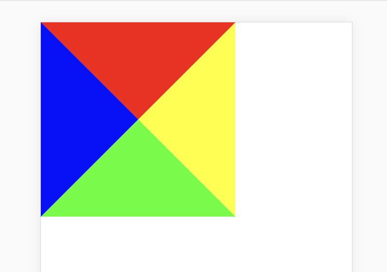
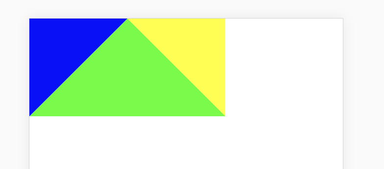
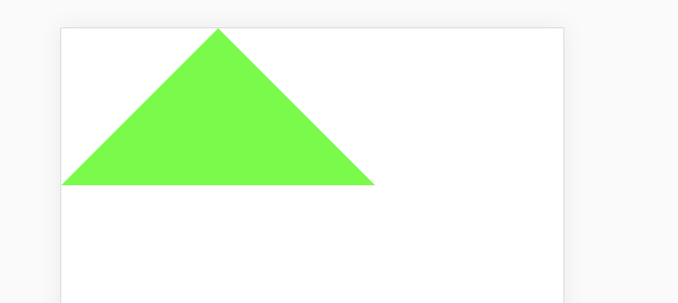
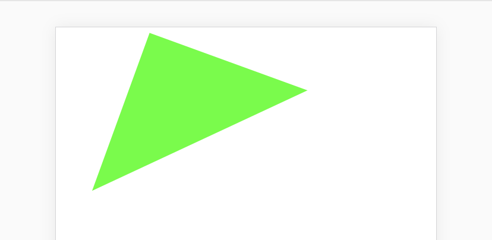

### 前端面试题

#### 1、DOMContentLoaded和onload事件区别和兼容

DOMContentLoaded事件是当初始HTML文档完全被加载和解析（即所有DOM解析完）时触发的，无需要等待样式列表、图片、子框架完成加载。onload事件要等页面所有元素，包括图片以及脚本等全部加载完成才触发，因此它比DOMContentLoaded要更晚执行。

#### 2、js基本数据类型

5个简单数据类型（基本数据类型）+ 1个复杂数据类型 undefiend, number string null boolean + object ES6 新增Symbol

#### 3、Promise实现

```html
<!DOCTYPE html>
<html>

<head>
    <meta charset="utf-8">
    <title></title>
    <meta name="viewport" content="width=device-width, initial-scale=1.0, maximum-scale=1.0, user-scalable=0">
    <meta content="yes" name="apple-mobile-web-app-capable">
    <meta content="black" name="apple-mobile-web-app-status-bar-style">
    <meta content="telephone=no" name="format-detection">
    <meta content="false" id="twcClient" name="twcClient">
    <meta content="sunny。all rights reserved" name="copyright" />
</head>

<body>
    <script type="text/javascript">
    	function Promise (fn) {
    		var state = 'pending';
    		var callbacks = []; // 回调函数数组
    		var val = null;
    		this.then = function (onFulfilled, onRejected) {
    			return new Promise (function (resolve, reject) {
    				// 在pending的时候会加回调函数，fulfilled会去执行
	    			if (state === 'pending') {
	    				callbacks.push(onFulfilled)
	    				return this
	    			}
	    			var cb = state === 'fulfilled' ? onFulfilled : onRejected;
	    			if (cb === null) {
	    				cb = state === 'fulfilled' ? resolve : reject;
	    				cb(val);
	    				return;
	    			}
	    			try {
	    				var ret = cb(val);
	    				resolve(ret);
	    			} catch (e) {
	    				reject(e);
	    			}

    			})
    		};
    		function resolve (newVal) {
    			if (newVal && (typeof newVal === 'object' || typeof newVal === 'function')) {
            		var then = newVal.then;
            		if (typeof then === 'function') {
                		then.call(newVal, resolve, reject);
                		return;
            		}
        		}
    			val = newVal;
    			state = 'fulfilled';
    			execute();
    		}
    		function reject (reason) {
    			state = 'reject';
    			val = reason;
    			execute();
    		}
		    function execute() {
		        setTimeout(function () {
		            callbacks.forEach(function (callback) {
		                handle(callback);
		            });
		        }, 0);
		    }
    		fn(resolve, reject);
    	}
    	function getUserId () {
    		return new Promise((resolve, reject) => {
    			resolve(9999)
    		});
    	}
    	getUserId().then(function (id) {
    		console.log(id);
    	});
    </script>
</body>

</html>

```

#### 4、使用css实现一个三角形

给一个div不设置宽度，设置四个border

```html
<style type="text/css">
* {
    margin: 0;
    padding: 0;
}
.sanjiao{
    width: 0;
    height: 0;
    border-top: 100px solid #f00;
    border-bottom: 100px solid #0f0;
    border-left: 100px solid #00f;
    border-right: 100px solid yellow;
}
</style>

<body>
    <div class="sanjiao"></div>
</body>
```


去除上边框

```html
<style type="text/css">
* {
    margin: 0;
    padding: 0;
}
.sanjiao{
    width: 0;
    height: 0;
    /*border-top: 100px solid #f00;*/
    border-bottom: 100px solid #0f0;
    border-left: 100px solid #00f;
    border-right: 100px solid yellow;
}
</style>

<body>
    <div class="sanjiao"></div>
</body>
```


左右颜色变透明

```html
<style type="text/css">
* {
    margin: 0;
    padding: 0;
}
.sanjiao{
    width: 0;
    height: 0;
    /*border-top: 100px solid #f00;*/
    border-bottom: 100px solid #0f0;
    border-left: 100px solid transparent;
    border-right: 100px solid transparent;
}
</style>

<body>
    <div class="sanjiao"></div>
</body>
```


旋转

```html
<style type="text/css">
* {
    margin: 0;
    padding: 0;
}
.sanjiao{
    width: 0;
    height: 0;
    /*border-top: 100px solid #f00;*/
    border-bottom: 100px solid #0f0;
    border-left: 100px solid transparent;
    border-right: 100px solid transparent;
    transform: rotate(-25deg);
}
</style>

<body>
    <div class="sanjiao"></div>
</body>
```


#### 5、call、apply、bind作用，以及用法

均用于改变函数内部this的指向，有以下不同

```js
Array.prototype.testFunc = function(a, b, c) {
    console.log(this, a, b, c);
};
var a = [1, 2, 3];
a.testFunc('a', 'b', 'c'); // [1, 2, 3] "a" "b" "c"
var b = {a: 'a', b: 'b'};
Array.prototype.testFunc.call(b, 'a', 'b', 'c'); // {a: "a", b: "b"} "a" "b" "c" console打印出的this已经改变
Array.prototype.testFunc.apply(b, ['a', 'b', 'c']); // {a: "a", b: "b"} "a" "b" "c" console打印出的this已经改变, 传参已改变
var c = Array.prototype.testFunc.bind(b, 'a', 'b', 'c'); // 不会执行
c(); // {a: "a", b: "b"} "a" "b" "c" console打印出的this已经改变，传参与call相同
```
#### 6、http常见状态码有哪些？401和403区别？

2XX 成功
· 200 OK，表示从客户端发来的请求在服务器端被正确处理
· 204 No content，请求收到，但返回信息为空（cors options请求）
3XX 重定向
· 301 moved permanently 永久性重定向，网页被永久性转移到另一个URL
· 302 found，临时性重定向 请求的网页被转移到一个新的地址，但客户访问仍继续通过原始URL地址
· 303 see other 表示资源存在着另一个 URL，建议客户访问其他URL或访问方式
· 304 not modified 缓存，自从上次请求后，请求的网页未修改过，服务器返回此响应时，不会返回网页内容，代表上次的文档已经被缓存了，还可以继续使用
· 307 temporary redirect，临时重定向，申明请求的资源临时性删除
4XX 客户端错误
· 400 bad request，请求报文存在语法错误
· 401 unauthorized，请求未经授权，认证信息不通过
· 403 forbidden，表示对请求资源的访问被服务器拒绝
· 404 not found，表示在服务器上没有找到请求的资源
5XX 服务器错误
· 500 internal sever error，表示服务器端在执行请求时发生了错误
· 503 service unavailable，表明服务器暂时处于超负载或正在停机维护，无法处理请求

#### 7、数组去重

直接在原数组上进行操作

```js
Array.prototype.quchong = function() {
    var arr = this;
    if (Array.isArray(arr)) {
        for (var i = 0, len = arr.length; i < len; i++) {
            if (arr.indexOf(arr[i]) !== arr.lastIndexOf(arr[i])) {
                arr.splice(i, 1);
                i--;
            }
        }
    }
    return arr;
};
var a = [1, 3, 1, 7, 3, 4, 1, 7, 3]
a.quchong();
console.log(a); // [4, 1, 7, 3]
```

不改变原数组

```js
Array.prototype.quchong = function() {
    var arr = this;
    var arr1 = [];
    if (Array.isArray(arr)) {
        for (var i = 0, len = arr.length; i < len; i++) {
            if (arr1.indexOf(arr[i]) === -1) {
                arr1.push(arr[i]);
            }
        }
    }
    return arr1;
};
var a = [1, 3, 1, 7, 3, 4, 1, 7, 3]
var b = a.quchong();
console.log(a, b); // [1, 3, 1, 7, 3, 4, 1, 7, 3] [1, 3, 7, 4]
```

#### 8、手写一个原生ajax

```js

var xhr = new XMLHttpRequest();
xhr.open(method, url, async);
xhr.send(postData);
xhr.onreadystatechange = function () {
    if (xhr.readyState === 4) {
        console.log(JSON.parse(xhr.responseText));
    }
}
```

#### 9、实现bind函数

```js
if (!Function.prototype.bind) {
    Function.prototype.bind = function () {
        var self = this,         // 保存原函数
            context = [].shift.call(arguments), // 保存需要绑定的this上下文
            args = [].slice.call(arguments);    // 剩余的参数转为数组
        return function () {                    // 返回一个新函数
            // 这里arguments和上一个不一样
            self.apply(context, [].concat.call(args, [].slice.call(arguments)));
        }
    }
}
```

#### 8、localStorage、cookie与session的区别

一、cookie详解
（1）简介

因为HTTP协议是无状态的，即服务器不知道用户上一次做了什么，这严重阻碍了交互式Web应用程序的实现。在典型的网上购物场景中，用户浏览了几个页面，买了一盒饼干和两饮料。最后结帐时，由于HTTP的无状态性，不通过额外的手段，服务器并不知道用户到底买了什么。为了做到这点，就需要使用到Cookie了。服务器可以设置或读取Cookies中包含信息，借此维护用户跟服务器会话中的状态。

Cookie（复数形态：Cookies），是指某些网站为了辨别用户身份、进行session跟踪而储存在用户本地终端上的数据（通常经过加密）。

Cookie是由服务端生成的，发送给客户端（通常是浏览器）的。Cookie总是保存在客户端中，按在客户端中的存储位置，可分为会话Cookie和持久Cookie：

内存Cookie由浏览器维护，保存在内存中，浏览器关闭后就消失了，其存在时间是短暂的。
硬盘Cookie保存在硬盘里，有一个过期时间，除非用户手工清理或到了过期时间，硬盘Cookie不会被删除，其存在时间是长期的。所以，按存在时间，可分为非持久Cookie和持久Cookie。
（2）作用

Cookie的根本作用就是在客户端存储用户访问网站的一些信息。典型的应用有：

记住密码，下次自动登录。
购物车功能。
记录用户浏览数据，进行商品（广告）推荐。
（3）缺陷 
①Cookie会被附加在每个HTTP请求中，所以无形中增加了流量。 
②由于在HTTP请求中的Cookie是明文传递的，所以安全性成问题。（除非用HTTPS） 
③Cookie的大小限制在4KB左右。对于复杂的存储需求来说是不够用的。

二、Session详解
（1）简介 
Session代表服务器与浏览器的一次会话过程，这个过程是连续的，也可以时断时续的。Session是一种服务器端的机制，Session 对象用来存储特定用户会话所需的信息。 
Session由服务端生成，保存在服务器的内存、缓存、硬盘或数据库中。

（2）工作原理 
当用户访问到一个服务器，如果服务器启用Session，服务器就要为该用户创建一个SESSION，在创建这个SESSION的时候，服务器首先检查这个用户发来的请求里是否包含了一个SESSION ID，如果包含了一个SESSION ID则说明之前该用户已经登陆过并为此用户创建过SESSION，那服务器就按照这个SESSION ID把这个SESSION在服务器的内存中查找出来（如果查找不到，就有可能为他新创建一个），如果客户端请求里不包含有SESSION ID，则为该客户端创建一个SESSION并生成一个与此SESSION相关的SESSION ID。这个SESSION ID是唯一的、不重复的、不容易找到规律的字符串，这个SESSION ID将被在本次响应中返回到客户端保存，而保存这个SESSION ID的正是COOKIE，这样在交互过程中浏览器可以自动的按照规则把这个标识发送给服务器。

（3）作用 
Session的根本作用就是在服务端存储用户和服务器会话的一些信息。典型的应用有：

判断用户是否登录。
购物车功能。
三、Cookie和Session的区别

1、存放位置不同： 
Cookie保存在客户端，Session保存在服务端。

2 、存取方式的不同： 
Cookie中保存的是字符串，Session保存的是对象

3、安全性（隐私策略）的不同 ： 
Cookie存储在浏览器中，对客户端是可见的，客户端的一些程序可能会窥探、复制以至修正Cookie中的内容。而Session存储在服务器上，对客户端是透明的，不存在敏感信息泄露的风险。 假如选用Cookie，比较好的方法是，敏感的信息如账号密码等尽量不要写到Cookie中。最好是像Google、Baidu那样将Cookie信息加密，提交到服务器后再进行解密，保证Cookie中的信息只要本人能读得懂。而假如选择Session就省事多了，反正是放在服务器上，Session里任何隐私都能够有效的保护。

4、有效期上的不同： 
只需要设置Cookie的过期时间属性为一个很大很大的数字，Cookie就可以在浏览器保存很长时间。 
由于Session依赖于名为JSESSIONID的Cookie，而Cookie JSESSIONID的过期时间默许为–1，只需关闭了浏览器（一次会话结束），该Session就会失效。

5、对服务器造成的压力不同 ： 
Cookie保管在客户端，不占用服务器资源。假如并发阅读的用户十分多，Cookie是很好的选择。 
Session是保管在服务器端的，每个用户都会产生一个Session。假如并发访问的用户十分多，会产生十分多的Session，耗费大量的内存。

6、 跨域支持上的不同 ： 
Cookie支持跨域名访问，例如将domain属性设置为“.baidu.com”，则以“.baidu.com”为后缀的一切域名均能够访问该Cookie。跨域名Cookie如今被普遍用在网络中。而Session则不会支持跨域名访问。Session仅在他所在的域名内有效。

以上整理于：https://blog.csdn.net/guoweimelon/article/details/50886092

四、localStorage
webstorage是HTML5新出的标签，是本地存储的解决方案之一，有sessionStorage与localStorage两种。

在HTML5中，新加入了一个localStorage特性，这个特性主要是用来作为本地存储来使用的，解决了cookie存储空间不足的问题(cookie中每条cookie的存储空间为4k)，localStorage中一般浏览器支持的是5M大小，这个在不同的浏览器中localStorage会有所不同。

webstorage拥有封装好的方法，如setItem， getItem， removeItem，clear等。不像cookie那样需要程序猿手动封装。cookie的作用是与服务器进行交互，作为http规范的一部分存在为webstorage。而webstorage仅仅是为了在本地存储数据而生，它们都保存在客户端浏览器。

cookie，localStorage， sessionStorage三者区别

cookie始终在同源的http请求中携带，即使不需要，cookie在浏览器和服务器中来回传递。而localStorage和sessionStora仅仅在本地存储，不会好服务器通信，也不会自动把数据发送给服务器。
存储大小不同，cookie为4kb左右；localStorage， sessionStorage可以达到5M
数据有效期不同，sessionStorage仅在同源窗口中有效，关闭窗口就消失了，cookie可以设置过期时间，localStorage长期有效
localStorage， sessionStorage有现成的API， cookie需要程序员手动封装


2、手写单链表查找倒数第k个节点
1、为了找出倒数第k个元素，最容易想到的办法是首先遍历一遍单链表，求出整个单链表的长度n，然后将倒数第k个，转换为正数第n-k个，接下来遍历一次就可以得到结果。但是该方法存在一个问题，即需要对链表进行两次遍历，第一次遍历用于求解单链表的长度，第二次遍历用于查找正数第n-k个元素。 
这种思路的时间复杂度是O(n)，但需要遍历链表两次。

2、如果我们在遍历时维持两个指针，第一个指针从链表的头指针开始遍历，在第k-1步之前，第二个指针保持不动；在第k-1步开始，第二个指针也开始从链表的头指针开始遍历。由于两个指针的距离保持在k-1，当第一个（走在前面的）指针到达链表的尾结点时，第二个指针（走在后面的）指针正好是倒数第k个结点。这种思路只需要遍历链表一次。对于很长的链表，只需要把每个结点从硬盘导入到内存一次。因此这一方法的时间效率前面的方法要高。

class Node{
    Node next=null;
    int data;
    public Node(int data){
        this.data=data;
    }
}
public class MyLinkedList {
 
    Node head=null;//链表头的引用
    public Node findElem(Node head,int k){
        if(k<1||k>this.length()){
            return null;
        }
        Node p1=head;
        Node p2=head;
        for(int i=0;i<k;i++)
            p1=p1.next;
        while(p1!=null){
            p1=p1.next;
            p2=p2.next;
        }
        return p2;
    }
    public static void main(String[] args) {
 
        MyLinkedList list=new MyLinkedList();
        list.addNode(1);
        list.addNode(2);
        list.addNode(3);
        list.addNode(4);
        list.addNode(5);
        MyLinkedList p=new MyLinkedList();
        p.head=list.findElem(list.head, 3);
        p.printList();
 
    }
 
}
3、http请求头，请求体，cookie在哪个里面？url在哪里面？
参考菜鸟教程HTTP专栏：http://www.runoob.com/http/http-tutorial.html 
人人三面的时候问我http请求头都有哪些值，答不上来。。GG 
客户端请求消息 
这里写图片描述 
服务器响应消息 
HTTP响应也由四个部分组成，分别是：状态行、消息报头、空行和响应正文。 
这里写图片描述

实例 
下面实例是一点典型的使用GET来传递数据的实例： 
客户端请求：

GET /hello.txt HTTP/1.1
User-Agent: curl/7.16.3 libcurl/7.16.3 OpenSSL/0.9.7l zlib/1.2.3
Host: www.example.com
Accept-Language: en, mi
服务端响应:

HTTP/1.1 200 OK
Date: Mon, 27 Jul 2009 12:28:53 GMT
Server: Apache
Last-Modified: Wed, 22 Jul 2009 19:15:56 GMT
ETag: "34aa387-d-1568eb00"
Accept-Ranges: bytes
Content-Length: 51
Vary: Accept-Encoding
Content-Type: text/plain
输出结果：

Hello World! My payload includes a trailing CRLF.
4、原型链的解释
饿了么面试的时候问到了，用友也问到了。没答好，GG. 
这里写图片描述

5、对闭包的理解，实现一个暴露内部变量，而且外部可以访问修改的函数
闭包的作用： 
匿名自执行函数、缓存、实现封装（主要作用）、实现面向对象中的对象

var person = function(){    
    //变量作用域为函数内部，外部无法访问    
    var name = "default";       
    return {    
       getName : function(){    
           return name;    
       },    
       setName : function(newName){    
           name = newName;    
       }    
    }    
}();    
print(person.name);//直接访问，结果为undefined    
print(person.getName());    
person.setName("a");    
print(person.getName());    
//得到结果如下：  
undefined  
default  
a


7、基本的两列自适应布局
左定右适应：

#div1{
    width: 100px;
    display: inline-block;
    background-color: black;
}
#div2{
    display: inline-block;
    position: absolute;
    left: 100px;
    right: 0px;
    background-color: red;
}
8、unix中常用的命令行
虽然上过linux课，但是命令忘得差不多了 尴尬。。。

9、OSI模型，HTTP,TCP,UDP分别在哪些层
这个可以参考我另一个博客： 
http://blog.csdn.net/qq_22944825/article/details/78160659 
OSI：物理层-数据链路层-网络层-传输层-会话层-表现层-应用层 
这里写图片描述

10、解释平衡二叉树，以及在数据结构中的应用（红黑树）
11、快排的时间复杂度和空间复杂度
一个特别好的总结的博客： 
http://web.jobbole.com/87968/ 
这里写图片描述

12、手写一个jQuery插件
1、$.extend(src) 
　　该方法就是将src合并到jquery的全局对象中去，如：

 $.extend({
      hello:function(){alert('hello');}
      });
2、$.fn.extend(src) 
　　该方法将src合并到jquery的实例对象中去，如:

 $.fn.extend({
  hello:function(){alert('hello');}
 });
13、在jquery方法和原型上面添加方法的区别和实现，以及jquery对象的实现
参考上一个问题答案~

使用jquery的第一件事就是要使用jquery对象，jquery对象和javascript中的DOM对象是不同的。

什么是jquery对象？jquery将一个DOM对象转化为jquery对象后就可以使用jquery类库提供的各种函数。可以将jquery对象理解为一个类，并且封装了很多的方法，而且可以动态的通过加载插件扩展这个类，类似于C#中的分布类partial class。

除了jQuery工具函数，jQuery的操作都是从jQuery对象开始。比如：

attr(key,value)
 

 
$("#myphoto").attr("src","/pic/1.jpg");
jQuery对象是一个特殊的集合对象。即使只有一个元素，jQuery对象仍然是一个集合。说其特殊是因为实际上jQuery对象是包含一个集合对象和各种函数的类。

14、手写一个递归函数
 function fact(num) {
    if (num <= 1) {
        return 1;             
    } else {
        return num * fact(num - 1);            
    }
} 
以下代码可导致出错：

var anotherFact = fact; 
 fact = null; 
 alert(antherFact(4)); //出错 
由于fact已经不是函数了，所以出错。 
用arguments.callee可解决问题，这是一个指向正在执行的函数的指针,arguments.callee返回正在被执行的对现象。 
新的函数为：

function fact(num) {
            if (num <= 1) {
                return 1;
            } else {
                return num * arguments.callee(num - 1); //此处更改了。 
            }
}
var anotherFact = fact;
fact = null;
alert(antherFact(4)); //结果为24.
15、对前端路由的理解？前后端路由的区别？
前端的路由和后端的路由在实现技术上不一样，但是原理都是一样的。在 HTML5 的 history API 出现之前，前端的路由都是通过 hash 来实现的，hash 能兼容低版本的浏览器。

http://10.0.0.1/
http://10.0.0.1/#/about
http://10.0.0.1/#/concat
服务端路由：每跳转到不同的URL，都是重新访问服务端，然后服务端返回页面，页面也可以是服务端获取数据，然后和模板组合，返回HTML，也可以是直接返回模板HTML，然后由前端JS再去请求数据，使用前端模板和数据进行组合，生成想要的HTML。

前端路由：每跳转到不同的URL都是使用前端的锚点路由，实际上只是JS根据URL来操作DOM元素，根据每个页面需要的去服务端请求数据，返回数据后和模板进行组合，当然模板有可能是请求服务端返回的，这就是 SPA 单页程序。

在js可以通过window.location.hash读取到路径加以解析之后就可以响应不同路径的逻辑处理。

history 是 HTML5 才有的新 API，可以用来操作浏览器的 session history (会话历史)。基于 history 来实现的路由可以和最初的例子中提到的路径规则一样。

H5还新增了一个hashchange事件，也是很有用途的一个新事件：

当页面hash(#)变化时，即会触发hashchange。锚点Hash起到引导浏览器将这次记录推入历史记录栈顶的作用，window.location对象处理“#”的改变并不会重新加载页面，而是将之当成新页面，放入历史栈里。并且，当前进或者后退或者触发hashchange事件时，我们可以在对应的事件处理函数中注册ajax等操作！ 
但是hashchange这个事件不是每个浏览器都有，低级浏览器需要用轮询检测URL是否在变化，来检测锚点的变化。当锚点内容(location.hash)被操作时，如果锚点内容发生改变浏览器才会将其放入历史栈中，如果锚点内容没发生变化，历史栈并不会增加，并且也不会触发hashchange事件。

16、介绍一下webpack和gulp，以及项目中具体的使用
17、你对es6的了解
参见阮大大的博客 
http://es6.ruanyifeng.com/

18、解释一下vue和react，以及异同点
异同点：vue官网给过答案 
https://cn.vuejs.org/v2/guide/comparison.html

只简单的用过vue，用vue写了一个日程表，请赐教哦~

https://yyywwwqqq.coding.me/schedule/dist/

源码地址： 
https://coding.net/u/yyywwwqqq/p/schedule/git

19、关于平衡二叉树
平衡二叉搜索树（Self-balancing binary search tree）又被称为AVL树（有别于AVL算法），且具有以下性质：它是一 棵空树或它的左右两个子树的高度差的绝对值不超过1，并且左右两个子树都是一棵平衡二叉树，同时，平衡二叉树必定是二叉搜索树，反之则不一定。平衡二叉树的常用实现方法有红黑树、AVL、替罪羊树、Treap、伸展树等。 最小二叉平衡树的节点的公式如下 F(n)=F(n-1)+F(n-2)+1 这个类似于一个递归的数列，可以参考Fibonacci(斐波那契)数列，1是根节点，F(n-1)是左子树的节点数量，F(n-2)是右子树的节点数量。

20、前后端分离的意义以及对前端工程化的理解

22、用promise手写ajax
function getJson(url){
    return new Promise((resolve, reject) =>{
        var xhr = new XMLHttpRequest();
        xhr.open('open', url, true);
        xhr.onreadystatechange = function(){
            if(this.readyState == 4){
                if(this.status = 200){
                    resolve(this.responseText, this)
                }else{
                    var resJson = { code: this.status, response: this.response }
                    reject(resJson, this)    
                }
            }
        }
        xhr.send()
    })
}
 
function postJSON(url, data) {
    return new Promise( (resolve, reject) => {
        var xhr = new XMLHttpRequest()
        xhr.open("POST", url, true)
        xhr.setRequestHeader("Content-type", "application/x-www-form-urlencoded");
        xhr.onreadystatechange = function () {
            if (this.readyState === 4) {
                if (this.status === 200) {
                    resolve(JSON.parse(this.responseText), this)
                } else {
                    var resJson = { code: this.status, response: this.response }
                    reject(resJson, this)
                }
            }
        }
        xhr.send(JSON.stringify(data))
    })
}
 
getJSON('/api/v1/xxx')    // => 这里面是就try
.catch( error => {
  // dosomething          // => 这里就是catch到了error，如果处理error以及返还合适的值
})
.then( value => {
  // dosomething          // 这里就是final
})
23、手写一个类的继承，并解释一下
继承的形式有很多中，js高程里面归纳了其中，我简单说一下前三种。 
1.原型继承

function Parent(){
    this.name = "parent";
}
Parent.prototype.getName = function(){
    return this.name;
}
 
function Child(){
    this.name = "child";
}
 
//继承parent
Child.prototype = new Parent();
2.构造函数继承

function Animal(name){
    this.name = name;
    this.eat = function(){
        consoel.log(this.name + "吃饭");
    }
}
var cat = new Animal("maomi");
cat.name;
cat.eat();
缺点是： 
3.组合继承


25、你说自己抗压能力强，具体表现在哪里？
略

26、对前端前景的展望，以后前端会怎么发展
27、手写第一次面试没有写出来的链表问题，要求用es6写
28、平时是怎么学技术的？
29、平时大学里面时间是怎么规划的？
30、接下来有什么计划？这个学期和下个学期的计划是？
31、项目中遇到的难点，或者你学习路上的难点
32、你是通过什么方法和途径来学习前端的
33、手写一个简单遍历算法
34、解释一下react和vue，以及区别
35、你在团队中更倾向于什么角色？
36、对java的理解
37、介绍node.js，并且介绍你用它做的项目
38、手写一个js的深克隆
function deepCopy(obj){
    //判断是否是简单数据类型，
    if(typeof obj == "object"){
        //复杂数据类型
        var result = obj.constructor == Array ? [] : {};
        for(let i in obj){
            result[i] = typeof obj[i] == "object" ? deepCopy(obj[i]) : obj[i];
        }
    }else {
        //简单数据类型 直接 == 赋值
        var result = obj;
    }
    return result;
}
39、for函数里面setTimeout异步问题
40、手写归并排序
<1>.长度为n(n>1),把该输入序列分成两个长度为n/2的子序列； 
<2>.对这两个子序列分别采用归并排序，直到长度n小于2； 
<3>.将两个排序好的子序列合并成一个最终的排序序列。

function mergeSort(arr) { 
    var len = arr.length;
    if(len < 2) {
        return arr;
    } else {
        middle = Math.floor(len / 2);
        var left = arr.slice(0, middle);
        var right = arr.splice(middle);
        return merge(mergeSort(left), mergeSort(right));
    }
 
}
 
function merge(left, right) {
    var result = [];
    while(left.length && right.length) {
        left[0] > right[0] ? result.push(right.shift()): result.push(left.shift());
    }
    if(left.length) {
        result = result.concat(left);
    }
    if(right.length) {
        result = result.concat(right);
    }
    return result;
}
41、介绍自己的项目
略

42、实现两个排序数组的合并
参考42题中的merge函数。

ajax：一种请求数据的方式，不需要刷新整个页面； 
ajax的技术核心是 XMLHttpRequest 对象； 
ajax 请求过程：创建 XMLHttpRequest 对象、连接服务器、发送请求、接收响应数据；

一个在stackoverflow的高分回答结合上面的代码，给出get和post的两种不同请求方法：

var ajax = {};
ajax.x = function () {
    if (typeof XMLHttpRequest !== 'undefined') {
        return new XMLHttpRequest();
    }
    var versions = [
    "MSXML2.XmlHttp.6.0",
    "MSXML2.XmlHttp.5.0",
    "MSXML2.XmlHttp.4.0",
    "MSXML2.XmlHttp.3.0",
    "MSXML2.XmlHttp.2.0",
    "Microsoft.XmlHttp"
    ];
 
    var xhr;
    for (var i = 0; i < versions.length; i++) {
        try {
            xhr = new ActiveXObject(versions[i]);
            break;
        } catch (e) {
        }
    }
    return xhr;
};
 
ajax.send = function (url, method, data, success,fail,async) {
    if (async === undefined) {
        async = true;
    }
    var x = ajax.x();
    x.open(method, url, async);
    x.onreadystatechange = function () {
        if (x.readyState == 4) {
            var status = x.status;
            if (status >= 200 && status < 300) {
                success && success(x.responseText,x.responseXML)
            } else {
                fail && fail(status);
            }
 
        }
    };
    if (method == 'POST') {
        x.setRequestHeader('Content-type', 'application/x-www-form-urlencoded');
    }
    x.send(data)
};
 
ajax.get = function (url, data, callback, fail, async) {
    var query = [];
    for (var key in data) {
        query.push(encodeURIComponent(key) + '=' + encodeURIComponent(data[key]));
    }
    ajax.send(url + (query.length ? '?' + query.join('&') : ''), 'GET', null, success, fail, async)
};
 
ajax.post = function (url, data, callback, fail, async) {
    var query = [];
    for (var key in data) {
        query.push(encodeURIComponent(key) + '=' + encodeURIComponent(data[key]));
    }
    ajax.send(url,'POST', query.join('&'), success, fail, async)
};
使用方法：GET

ajax.get('/test.php', {foo: 'bar'}, function(response,xml) {
    //success
},
function(status){
    //fail
});
POST

ajax.post('/test.php', {foo: 'bar'}, function(response,xml) {
    //succcess
 
},function(status){
    //fail
 
});
44、手写一个promise版的ajax

46、手写实现requireJS模块实现
47、手写实现jquery里面的insertAfter
48、react和vue的介绍以及异同
49、AMD和CMD，commonJS的区别
50、介绍一下backbone
51、了解过SEO吗？

52、低版本浏览器不支持HTML5标签怎么解决？

53、用js使低版本浏览器支持HTML5标签 底层是怎么实现的？

54、实现一个布局：左边固定宽度为200，右边自适应，而且滚动条要自动选择只出现最高的那个

55、画出盒子模型，要使谷歌浏览器的盒子模型显示得跟IE浏览器一致（让谷歌跟ie一致，不是ie跟谷歌一致），该怎么做？

56、手写JS实现类继承，讲原型链原理，并解释new一个对象的过程都发生了什么

57、Array对象自带的方法，一一列举

58、若干个数字，怎么选出最大的五个

59、Array对象自带的排序函数底层是怎么实现的？

60、常用的排序算法有哪些，介绍一下选择排序

61、了解navigator对象吗？

62、手写一个正则表达式，验证邮箱

63、link和@import引入CSS的区别？

64、刚才说有些浏览器不兼容@import，具体指哪些浏览器？

65、介绍一下cookie,localstorage,sessionstorage,session

66、jquery绑定click的方法有几种

67、你的优点/竞争力

68、移动端适配问题

69、react的难点在哪里

70、做过css动画吗

71、如何优化网站

72、以后的规划

73、你做过最困难的事情是啥？

74、css3 html5新特性

75、闭包，ES6，跨域

76、问做过啥项目，用到什么技术，遇到什么困难

77、兼容性

78、盒子模型

79、Array的unshift() method的作用是什么？如何连接两个Array？如何在Array里移除一个元素？

80、用纸笔写一个Closure，任意形式和内容

81、知不知道Array-like Object？

82、如何用Native JavaScript来读写Cookie？

83、知不知道CSS Box-model？

84、如何做一个AJAX Request？

85、Cross-domain access有没有了解？

86、前端安全方面有没有了解？XSS和CSRF如何攻防？

87、HTTP Response的Header里面都有些啥？

88、知不知道HTTP2？

89、输入URL后发生了什么？

90、new operator实际上做了什么？

91、面向对象的属性有哪些？

92、做一个两栏布局，左边fixed width，右边responsive，用纸笔手写

93、讲一下AJAX Request

94、讲一下Cross-domain access

95、介绍一下做过的项目

96、问到了多个服务器怎么弄，架构之类的

97、angular的渲染流程

98、脏检查

99、nodejs的架构、优缺点、回调

100、css 盒模型

101、css 布局，左边定宽右边自适应

102、冒泡和捕获，事件流哪三个阶段？

103、实现事件代理

104、原型链

105、继承的两种方法

106、ajax，原生ajax的四个过程

107、闭包，简单说一个闭包的应用，然后闭包的主要作用是什么

108、css:两个块状元素上下的margin-top和margin-bottom会重叠。啥原因？怎么解决？

109、js：写一个递归。就是每隔5秒调用一个自身，一共100次

110、cookie和session有什么区别

111、网络分层结构

112、你的不足是什么？

113、做了那么多项目，有没有自己的归纳总结

114、工程怎么进行文件管理

115、less和sass掌握程度

116、Cookie 是否会被覆盖，localStorage是否会被覆盖

117、事件代理js实现

118、Css实现动画效果

119、Animation还有哪些其他属性

120、Css实现三列布局

121、Css实现保持长宽比1:1

122、Css实现两个自适应等宽元素中间空10个像素

123、requireJS的原理是什么

124、如何保持登录状态

125、浮动的原理以及如何清除浮动

126、Html的语义化

127、原生js添加class怎么添加，如果本身已经有class了，会不会覆盖，怎么保留？

128、Jsonp的原理。怎么去读取一个script里面的数据？

129、如果页面初始载入的时候把ajax请求返回的数据存在localStorage里面，然后每次调用的时候去localStorage里面取数，是否可行。

130、304是什么意思？有没有方法不请求不经过服务器直接使用缓存

131、http请求头有哪些字段

132、数组去除一个函数。用arr.splice。又问splice返回了什么？应该返回的是去除的元素。

133、js异步的方法（promise，generator，async）

134、Cookie跨域请求能不能带上

135、最近看什么开源项目？

136、commonJS和AMD

137、平时是怎么学习的？

138、为什么要用translate3d？

139、对象中key-value的value怎么再放一个对象？

140、Get和post的区别？

145、Post一个file的时候file放在哪的？

146、说说你对组件的理解

147、组件的html怎么进行管理

148、js的异步加载，promise的三种状态，ES7中的async用过么

149、静态属性怎么继承

150、js原型链的继承

151、jquery和zepto有什么区别

152、angular的双向绑定原理

153、angular和react的认识

154、MVVM是什么

155、移动端是指手机浏览器，还是native，还是hybrid

156、你用了移动端的什么库类和框架？

157、移动端要注意哪些？

158、适配有去考虑么，retina屏幕啊？

159、rem是什么？em是什么？如果上一层就是根root了，em和rem等价么？

160、怎么测试的？会自动化测试么？

161、你觉得你什么技术最擅长？

162、你平时有没有什么技术的沉淀？

163、单向链表怎么查找有没有环？

164、怎么得到一个页面的a标签？

165、怎么在页面里放置一个很简单的图标，不能用img和background-img？

166、正则表达式判断url

167、怎么去除字符串前后的空格

168、实现页面的局部刷新

169、绝对定位与相对定位的区别

170、js轮播实现思路

171、使用js画一个抛物线，抛物线上有个小球随着抛物线运动，有两个按钮能使小球继续运动停止运动

172、java五子棋，说下实现思路

173、如何让各种情况下的div居中(绝对定位的div,垂直居中,水平居中)？

174、display有哪些值？说明他们的作用

175、css定义的权重

176、requirejs实现原理

177、requirejs怎么防止重复加载

178、ES6里头的箭头函数的this对象与其他的有啥区别

179、tcp/udp区别

180、tcp三次握手过程

181、xss与csrf的原理与怎么防范

182、mysql与 MongoDB的区别

183、w3c事件与IE事件的区别

184、有没有上传过些什么npm模块

185、IE与W3C怎么阻止事件的冒泡

186、gulp底层实现原理

187、webpack底层实现原理

188、gulp与webpack区别

189、vuejs与angularjs的区别

190、vuex是用来做什么的

191、说下你知道的响应状态码

192、ajax的过程以及 readyState几个状态的含义

193、你除了前端之外还会些什么？

195、一些关于php与java的问题

196、你觉得你哪个项目是你做的最好的

197、说说你在项目中遇到了哪些困难,是怎么解决的

198、前端优化你知道哪些

199、webpack是用来干嘛的

200、webpack与gulp的区别

201、es6与es7了解多少

202、说下你知道的响应状态码

203、看过哪些框架的源码

204、遇到过哪些浏览器兼容性问题

205、清除浮动有哪几种方式,分别说说

206、你知道有哪些跨域方式,分别说说

207、JavaScript有哪几种类型的值

208、使用 new操作符时具体是干了些什么

209、学习前端的方法以及途径

210、怎么实现两个大整数的相乘，说下思路

211、你学过数据结构没,说说你都了解些什么

212、你学过计算机操作系统没,说说你都了解些什么

213、你学过计算机组成原理没,说说你都了解些什么

214、你学过算法没,说说你都了解些什么

215、说下选择排序,冒泡排序的实现思路

216、用过哪些框架

217、让你设计一个前端css框架你怎么做

218、了解哪些设计模式说说看

219、说下你所了解的设计模式的优点

220、vue源码结构

221、状态码

222、浏览器缓存的区别

223、304与200读取缓存的区别

224、http请求头有哪些,说说看你了解哪些

225、js中this的作用

226、js中上下文是什么

228、你所了解的跨域的方法都说说看你了解的？

229、要是让你自己写一个js框架你会用到哪些设计模式

230、平常在项目中用到过哪些设计模式,说说看

231、一来给了张纸要求写js自定义事件

232、前端跨域的方法

234、h5有个api能定位你知道是哪个吗？

235、vue与angularjs中双向数据绑定是怎样实现的？

236、webpack怎样配置？

237、nodejs中的文件怎么读写？

238、link和@import有什么区别？

239、cookies，sessionStorage 和 localStorage 的区别

240、看过哪些前端的书？平时是怎么学习的

241、说下你所理解的mvc与mvvc

242、position有哪些值,说下各自的作用

243、写个从几个li中取下标的闭包代码

244、你的职业规划是怎么样的？

245、移动端性能优化

246、lazyload如何实现

247、点透问题

248、前端安全

249、原生js模板引擎

250、repaint和reflow区别

251、requirejs如何避免循环依赖？

252、实现布局：左边一张图片，右边一段文字（不是环绕）

253、window.onload和$(document).ready()的区别，浏览器加载转圈结束时哪个时间点？

254、form表单当前页面无刷新提交 target iframe

255、setTimeout和setInterval区别，如何互相实现？

256、如何避免多重回调—promise，promise简单描述一下，如何在外部进行resolve()

257、margin坍塌？水平方向会不会坍塌？

258、伪类和伪元素区别

259、vue如何实现父子组件通信，以及非父子组件通信


261、使用flex布局实现三等分，左右两个元素分别贴到左边和右边，垂直居中

262、平时如何学前端的，看了哪些书，关注了哪些公众号

264、数组和链表区别，分别适合什么数据结构

265、对mvc的理解

266、描述一个印象最深的项目，在其中担任的角色，解决什么问题

268、描述下二分查找

269、为什么选择前端，如何学习的，看了哪些书，《js高级程序设计》和《你不知道的js》有什么区别，看书，看博客，看公众号三者的时间是如何分配的？

270、如何评价BAT？

271、描述下在实习中做过的一个项目，解决了什么问题，在其中担任了什么角色？这个过程存在什么问题，有什么值得改进的地方？

272、如何看待加班，如果有个项目需要连续一个月加班，你怎么看？

273、遇到的压力最大的一件事是什么？如何解决的？

274、平时有什么爱好

275、自身有待改进的地方

276、n长的数组放入n+1个数，不能重复，找出那个缺失的数

277、手里有什么offer

278、你对于第一份工作最看重的三个方面是什么？

279、如何评价现在的前端？

280、用原生js实现复选框选择以及全选非全选功能

281、用4个颜色给一个六面体上色有多少种情况

282、amd和cmd区别

283、为什么选择前端，移动端性能优化

284、vue的特点？双向数据绑定是如何实现的

285、Object.defineProperty

286、算法题：数组去重，去除重复两次以上的元素，代码题：嵌套的ul-li结构，根据input中输入的内容，去除相应的li节点，且如果某个嵌套的ul下面的li都被移除，则该ul的父li节点也要被移除

287、页面加载过程

288、浏览器如何实现图片缓存
